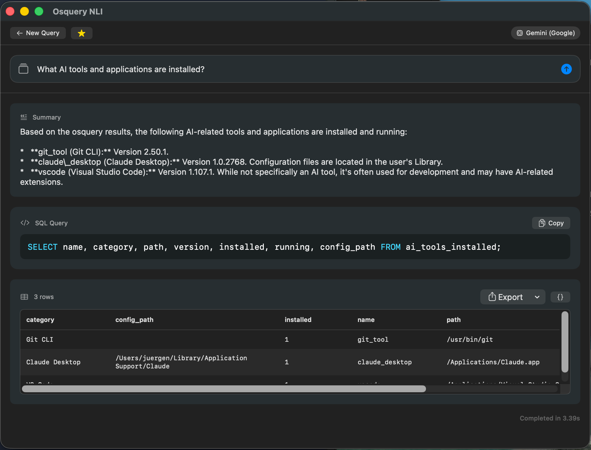

# Osquery NLI

[](https://github.com/juergen-kc/OsqueryNLI/releases)
[](https://github.com/juergen-kc/OsqueryNLI)
[](https://opensource.org/licenses/MIT)

**Natural Language Interface for Osquery** - Ask questions about your Mac in plain English

Osquery NLI is a macOS menu bar app that lets you query your system using natural language instead of SQL. It uses AI (Gemini, Claude, or GPT) to translate your questions into osquery SQL and presents the results in a user-friendly format.



## Features

### Core Features
- **Natural Language Queries** - Ask questions like "What apps start at login?" or "Which processes are using the most memory?"
- **Multiple AI Providers** - Choose between Google Gemini, Anthropic Claude, or OpenAI GPT
- **AI Discovery Tables** - Custom osquery extension with 10 tables to discover AI tools, MCP servers, models, and more
- **Query Templates** - Pre-built templates for common queries across system, network, security, and AI categories
- **Schema Browser** - Browse and search osquery tables with full keyboard navigation

### Organization & Productivity
- **Query History** - Track and rerun previous queries with search and filtering
- **Favorites** - Save frequently used queries with drag-and-drop reordering
- **Scheduled Queries** - Run queries automatically at configurable intervals
- **Notifications & Alerts** - Get notified when query results match conditions

### Export & Integration
- **Export Results** - Export to JSON, CSV, Markdown, or Excel with recent exports quick access
- **MCP Server** - Built-in Model Context Protocol server for Claude Desktop, Cursor, and other AI assistants
- **Siri Shortcuts** - Run queries via Shortcuts app automation

### User Experience
- **Menu Bar App** - Lightweight, always-accessible from the menu bar
- **Keyboard Shortcuts** - Full keyboard navigation and shortcuts
- **Accessibility** - VoiceOver support throughout the app
- **Undo Support** - 5-second undo window for destructive actions

## Requirements

- macOS 14.0 (Sonoma) or later
- [osquery](https://osquery.io/) installed (`brew install osquery`)
- API key for at least one AI provider (Gemini, Claude, or OpenAI)

## Installation

### From Homebrew (Recommended)

```bash
# Add the tap
brew tap juergen-kc/tap

# Install Osquery NLI (and osquery if needed)
brew install --cask osquery-nli
brew install osquery
```

### From DMG

1. Download the latest `OsqueryNLI-x.x.x.dmg` from [Releases](https://github.com/juergen-kc/OsqueryNLI/releases)
2. Open the DMG and drag `Osquery NLI.app` to Applications
3. Launch from Applications or Spotlight

### From Source

```bash
# Clone the repository
git clone https://github.com/juergen-kc/OsqueryNLI.git
cd OsqueryNLI

# Build
swift build -c release

# Run
.build/release/OsqueryNLI
```

## Setup

1. **Install osquery** (if not already installed):
   ```bash
   brew install osquery
   ```

2. **Configure AI Provider**:
   - Open Osquery NLI from the menu bar
   - Go to Settings > Provider
   - Select your preferred AI provider
   - Enter your API key

3. **Get API Keys**:
   - **Gemini**: [Google AI Studio](https://makersuite.google.com/app/apikey)
   - **Claude**: [Anthropic Console](https://console.anthropic.com/)
   - **OpenAI**: [OpenAI Platform](https://platform.openai.com/api-keys)

## Usage

### Basic Queries

Click the menu bar icon and type your question in natural language:

- "What is the system uptime?"
- "Show me the top 10 processes using the most memory"
- "What ports are listening for connections?"
- "Is FileVault enabled?"
- "What USB devices are connected?"

### AI Discovery Queries

With the bundled AI Discovery extension, you can query AI-related information:

- "What AI tools are installed?"
- "Show MCP server configurations"
- "What AI browser extensions do I have?"
- "Which AI code assistants are configured?"
- "Are any local AI servers running?"

### Keyboard Shortcuts

| Shortcut | Action |
|----------|--------|
| `⌘↩` | Submit query |
| `⌘K` | Clear and start new query |
| `↑` / `↓` | Navigate query history |
| `Esc` | Cancel running query / Exit history |

### Query Templates

Click "Browse Templates" to access pre-built queries organized by category:
- System Info
- Processes
- Network
- Security
- Hardware
- Software
- Files & Storage
- Troubleshooting
- AI Discovery

## AI Discovery Extension

Osquery NLI includes a custom osquery extension that adds 10 tables for discovering AI tools and configurations:

| Table | Description |
|-------|-------------|
| `ai_tools_installed` | Installed AI applications (Cursor, VS Code, Claude Desktop, etc.) |
| `ai_mcp_servers` | MCP (Model Context Protocol) server configurations |
| `ai_env_vars` | AI-related environment variables |
| `ai_browser_extensions` | AI extensions in Chrome, Brave, Arc, Firefox |
| `ai_code_assistants` | Code assistant configurations (Copilot, Continue, Cody, etc.) |
| `ai_api_keys` | Configured AI API keys (presence only, not values) |
| `ai_local_servers` | Local AI servers (Ollama, LM Studio, LocalAI, etc.) |
| `ai_models_downloaded` | Downloaded AI models (Ollama, LM Studio, HuggingFace cache) |
| `ai_containers` | AI-related Docker containers |
| `ai_sdk_dependencies` | AI SDK dependencies in project files |

The extension is bundled with the app and loads automatically - no additional setup required.

## Architecture

```
OsqueryNLI/
├── Sources/
│   ├── OsqueryNLI/           # Main SwiftUI app
│   │   ├── App/              # App entry point, state management
│   │   ├── Core/             # Services (LLM, Osquery)
│   │   └── Features/         # UI features (Query, Settings)
│   ├── OsqueryNLICore/       # Shared library
│   │   ├── OsqueryService    # Osquery execution
│   │   ├── ProcessRunner     # Process management
│   │   └── Models            # Data models
│   └── OsqueryMCPServer/     # MCP server executable
├── Resources/
│   └── ai_tables.ext         # AI Discovery osquery extension
├── Distribution/
│   ├── Info.plist            # App bundle metadata
│   ├── Entitlements.plist    # App entitlements
│   └── AppIcon.png           # App icon source
└── scripts/
    └── build-release.sh      # Release build script
```

## MCP Server Integration

Osquery NLI includes an MCP (Model Context Protocol) server that allows AI assistants like Claude Desktop or Cursor to query your system.

### Enable MCP Server

1. Go to Settings > General
2. Enable "MCP Server"
3. Copy the configuration for your AI assistant

### Claude Desktop Configuration

Add to `~/Library/Application Support/Claude/claude_desktop_config.json`:

```json
{
  "mcpServers": {
    "osquery": {
      "command": "/Applications/OsqueryNLI.app/Contents/Resources/OsqueryMCPServer"
    }
  }
}
```

### Cursor Configuration

Add to Cursor's MCP settings:

```json
{
  "mcpServers": {
    "osquery": {
      "command": "/Applications/OsqueryNLI.app/Contents/Resources/OsqueryMCPServer"
    }
  }
}
```

## Configuration

### Table Selection

By default, a curated set of tables is enabled. You can customize which tables are available:

1. Go to Settings > Tables
2. Search for specific tables
3. Enable/disable individual tables
4. Click "Recommended" to reset to defaults

### Query Cache

Query results are cached for 5 minutes to improve response time. The cache is invalidated when:
- Provider or model changes
- Enabled tables change
- Cache expires (5 minutes)

To force a fresh query, use the refresh button on the results view.

## Building from Source

### Prerequisites

- Xcode 15+ or Swift 6.0+
- macOS 14.0+

### Development Build

```bash
swift build
swift run OsqueryNLI
```

### Release Build

```bash
swift build -c release
```

### Creating a Distributable DMG

The project includes a build script that handles code signing, notarization, and DMG creation:

```bash
# Full release (requires Apple Developer ID)
./scripts/build-release.sh

# Skip notarization (for testing)
./scripts/build-release.sh --skip-notarize
```

#### Prerequisites for Release Build

1. **Apple Developer Certificate**:
   ```bash
   security find-identity -v -p codesigning | grep "Developer ID"
   ```

2. **Notarization Credentials**:
   ```bash
   xcrun notarytool store-credentials "AC_PASSWORD" \
     --apple-id "YOUR_APPLE_ID@email.com" \
     --team-id "YOUR_TEAM_ID"
   ```
   Replace with your actual Apple Developer credentials.

## Building the AI Discovery Extension

The AI Discovery extension is written in Go and located in `../osquery-ai-tables`:

```bash
cd ../osquery-ai-tables
go build -o ai_tables.ext .
cp ai_tables.ext ../OsqueryNLI_Swift/Resources/
```

### AI Discovery Extension Tables

The extension provides 10 virtual tables:

**ai_tools_installed** - Discovers installed AI tools
- Scans `/Applications` for known AI apps
- Checks if processes are running
- Returns: name, category, path, version, installed, running, config_path

**ai_mcp_servers** - Parses MCP configurations
- Reads Claude Desktop config
- Reads Cursor MCP config
- Reads VS Code MCP config
- Returns: name, config_file, server_type, command, args, url, has_env_vars, has_api_key, source_app

**ai_env_vars** - Finds AI-related environment variables
- Checks for API keys (OPENAI_API_KEY, ANTHROPIC_API_KEY, etc.)
- Checks for AI tool configs
- Returns: variable_name, source, source_file, is_set, value_preview (masked), category

**ai_browser_extensions** - Discovers AI browser extensions
- Scans Chrome, Brave, Arc, Firefox
- Identifies AI-related extensions
- Returns: name, browser, extension_id, version, enabled, ai_related, path

**ai_code_assistants** - Finds code assistant configurations
- GitHub Copilot, Continue.dev, Cursor, Cody, Codeium, Tabnine
- Returns: name, tool, config_type, config_path, enabled, details

**ai_api_keys** - Checks for configured API keys
- Environment variables
- Shell profiles (.zshrc, .bashrc)
- .env files
- Returns: service, source, env_var_name, key_present, key_prefix, key_length

**ai_local_servers** - Detects local AI servers
- Ollama, LM Studio, LocalAI, llama.cpp, vLLM
- Returns: name, service_type, pid, port, status, endpoint, model_loaded, version

**ai_models_downloaded** - Discovers downloaded AI models
- Scans Ollama models directory
- Scans LM Studio models directory
- Scans HuggingFace cache
- Returns: name, source, path, size, format, quantization, modified_time

**ai_containers** - Detects AI-related Docker containers
- Identifies containers running AI workloads
- Detects Ollama, LocalAI, vLLM, text-generation-inference
- Returns: container_id, name, image, status, ports, gpu_enabled, created

**ai_sdk_dependencies** - Finds AI SDK dependencies in projects
- Scans package.json for npm packages
- Scans requirements.txt for Python packages
- Scans go.mod for Go modules
- Returns: name, version, package_manager, project_path, sdk_type

## Troubleshooting

### "osquery not found"

Ensure osquery is installed and accessible:
```bash
brew install osquery
which osqueryi
```

### "Cannot answer with available tables"

This means the AI couldn't find a suitable table for your query:
1. Go to Settings > Tables
2. Click "Recommended" to enable common tables
3. Or enable specific tables needed for your query

### AI Discovery tables not showing

1. Go to Settings > General
2. Ensure "Enable AI Discovery Tables" is on
3. Status should show "Available"
4. Go to Settings > Tables and click "Recommended"

### Extension loading issues (Intel Macs)

The AI Discovery extension is built for arm64. On Intel Macs or when osquery runs as x86_64, the app automatically uses `arch -arm64` to ensure compatibility.

### Queries timing out

Extension queries require time for the extension to register. The app uses `--extensions_require=ai_tables --extensions_timeout=10` to ensure proper loading.

### Extension conflicts with osquery daemon

If you see errors like "Registry item ai_env_vars conflicts with another item of the same name" or "no such table: ai_code_assistants", it means the osquery daemon is running an older version of the AI tables extension.

**Solution**: Update the daemon's extension and restart:

```bash
# Copy the new extension to the daemon's extension folder
sudo cp /Applications/OsqueryNLI.app/Contents/Resources/ai_tables.ext /var/osquery/extensions/

# Restart osqueryd (it will auto-restart via launchd)
sudo pkill osqueryd
```

The daemon should automatically restart. Verify with:
```bash
pgrep osqueryd
```

## Privacy & Security

- **API Keys**: Stored securely in macOS Keychain
- **Queries**: Processed by your selected AI provider (data leaves your machine)
- **Results**: Cached locally, never sent externally
- **AI Discovery**: Scans only for presence of AI tools, never reads credentials or sensitive data
- **No Telemetry**: The app doesn't collect or send any usage data

## Version History

### 1.5.2
- Undo support for destructive actions (5-second undo window)
- Template search ranking by relevance
- Favorites drag-and-drop reordering
- Recent exports quick access from Export menu

### 1.5.1
- Full keyboard navigation throughout the app
- Comprehensive accessibility labels for VoiceOver
- Improved test coverage (120 tests)

### 1.5.0
- Scheduled queries with configurable intervals
- Notifications and alerts when query results match conditions
- 3 new AI Discovery tables (ai_models_downloaded, ai_containers, ai_sdk_dependencies)
- Schema browser with search and full keyboard navigation
- Markdown export format

### 1.0.4
- MCP server improvements and bug fixes
- Query history refresh button
- Unit tests for history logging
- Polish: accessibility labels, keyboard hints, animations
- Better error handling for table loading and file exports
- Result set truncation for large queries (1000 rows displayed)

### 1.0.3
- Homebrew formula with auto-update checker
- UX enhancements: window persistence, input history navigation

### 1.0.0
- Initial release
- Support for Gemini, Claude, and OpenAI
- AI Discovery extension with 7 tables
- Query templates library
- MCP server integration
- Code-signed and notarized for macOS distribution

## License

MIT License - see LICENSE file for details.

## Acknowledgments

- [osquery](https://osquery.io/) - The SQL-powered operating system instrumentation framework
- [osquery-go](https://github.com/osquery/osquery-go) - Go bindings for osquery extensions
- [Google Generative AI Swift SDK](https://github.com/google/generative-ai-swift) - Gemini API client
- [MCP Swift SDK](https://github.com/modelcontextprotocol/swift-sdk) - Model Context Protocol implementation

## Contributing

Contributions are welcome! Please feel free to submit issues and pull requests.

1. Fork the repository
2. Create your feature branch (`git checkout -b feature/amazing-feature`)
3. Commit your changes (`git commit -m 'Add amazing feature'`)
4. Push to the branch (`git push origin feature/amazing-feature`)
5. Open a Pull Request
